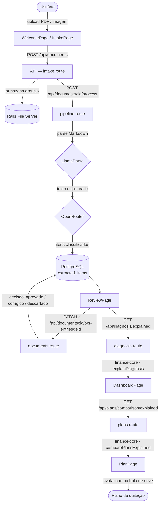
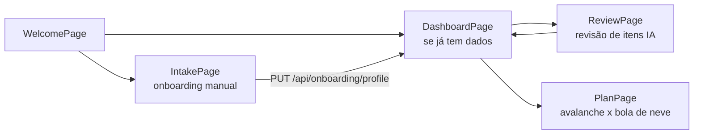
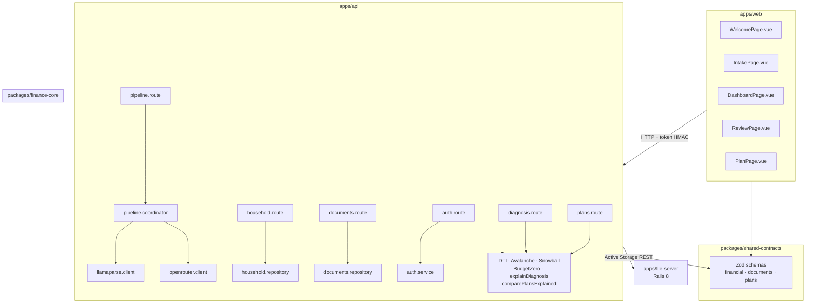

# Controle Financeiro Familiar

SaaS de planejamento financeiro e recuperação de ativos para famílias superendividadas. O sistema recebe documentos financeiros via upload manual, processa e classifica as informações com IA (LlamaParse + OpenRouter), apresenta uma revisão humana assistida e gera um diagnóstico objetivo acompanhado de um plano de quitação de dívidas passo a passo.

---

## Fluxo completo do sistema



---

## Jornada do usuário (telas)



---

## Arquitetura de módulos



---

## Contratos de dados principais (`shared-contracts`)

```
financial.schemas.ts   ── incomeSchema · debtSchema · budgetEnvelopeSchema
                          financialCaseSchema · onboardingProfileInputSchema
                          extractedItemSchema · reviewItemInputSchema

documents.schemas.ts   ── documentSchema · fileServerDocumentSchema
                          RegisterDocumentInput · UpdateOcrEntryInput
                          ReviewExtractedItemParams

plans.schemas.ts       ── planComparisonSchema          (avalanche vs bola de neve básico)
                          planComparisonExplainedSchema  (+ estratégia + racional + narrativa)
                          actionPlanSchema               (cronograma mês a mês)
```

---

## Pipeline de IA (mock-safe)

```
POST /api/documents/:id/process
        │
        ├─ Valida MIME (pdf · png · jpg · webp · heic)
        ├─ Valida tamanho base64 ≤ 10 MB
        │
        ├─ MOCK_EXTERNAL_SERVICES=true ──► resposta fictícia local (dev/test)
        │
        └─ produção
               ├─ LlamaParse  → Markdown estruturado
               └─ OpenRouter  → classificação por item
                      ├─ income
                      ├─ fixed-expense / variable-expense
                      ├─ debt-installment / future-installment
                      ├─ overdue-debt / loan-contract
                      ├─ credit-card-purchase / dda-obligation
                      └─ ignored / ambiguous
```

---

## Algoritmos financeiros (`finance-core`)

| Função | Entrada | Saída |
|--------|---------|-------|
| `calculateDti` | incomes, debts | razão 0–1 |
| `classifyDti` | razão | `healthy` · `moderate` · `critical` |
| `avalanchePlan` | debts, extra | cronograma de parcelas |
| `snowballPlan` | debts, extra | cronograma de parcelas |
| `explainDiagnosis` | financialCase | narrativa + DTI + status + alertas |
| `comparePlansExplained` | financialCase | avalanche vs bola de neve + estratégia recomendada |
| `buildZeroBudget` | financialCase | envelopes por categoria |

> Todos os cálculos usam **decimal.js** — sem erros de ponto flutuante.

---

## Endpoints da API

| Método | Rota | Descrição |
|--------|------|-----------|
| `POST` | `/api/auth/register` | cadastro de conta |
| `POST` | `/api/auth/login` | login → token HMAC |
| `GET` | `/api/onboarding/profile` | lê perfil financeiro |
| `PUT` | `/api/onboarding/profile` | salva perfil financeiro |
| `POST` | `/api/documents` | registra documento |
| `GET` | `/api/documents` | lista documentos |
| `GET` | `/api/documents/:id/review` | detalhes + itens extraídos |
| `POST` | `/api/documents/:id/process` | dispara pipeline de IA |
| `GET` | `/api/documents/:id/process` | status do pipeline |
| `PATCH` | `/api/documents/:id/ocr-entries/:eid` | revisão humana de item |
| `GET` | `/api/diagnosis/explained` | diagnóstico narrativo |
| `GET` | `/api/plans/comparison` | planos básicos |
| `GET` | `/api/plans/comparison/explained` | planos + estratégia recomendada |

---

## Stack tecnológica

| Camada | Tecnologia |
|--------|-----------|
| Frontend | Vue 3 (Options API), PrimeVue, ApexCharts |
| Backend | Node.js, Fastify 5, PostgreSQL 16 |
| Servidor de arquivos | Ruby on Rails 8 (API-only) |
| Motor financeiro | `packages/finance-core` (decimal.js) |
| Contratos | `packages/shared-contracts` (Zod) |
| IA externa | LlamaParse (parse) + OpenRouter (classificação) |
| Contexto semântico | Cognee (opcional) |
| Containerização | Docker + Docker Compose |

---

## Documentação

- [docs/arquitetura.md](docs/arquitetura.md) — decisões estruturais e diagrama de componentes
- [docs/mvp-inicial.md](docs/mvp-inicial.md) — escopo e módulos do MVP
- [docs/padroes-de-desenvolvimento.md](docs/padroes-de-desenvolvimento.md) — convenções de código
- [docs/docker-e-compose.md](docs/docker-e-compose.md) — guia de ambientes e variáveis
- [docs/jornada-do-usuario.md](docs/jornada-do-usuario.md) — fluxo completo pelo olhar do usuário
- [apps/file-server/README.md](apps/file-server/README.md) — contrato de API do servidor de arquivos
- [.github/copilot-instructions.md](.github/copilot-instructions.md) — instruções para o GitHub Copilot

---

## Início rápido (desenvolvimento)

```bash
# Pré-requisitos: Docker Desktop, Node.js ≥ 24, pnpm 10
pnpm install
pnpm run dev          # sobe todos os serviços via Docker Compose
# ou diretamente sem Docker:
node scripts/dev-local.mjs
```

As variáveis de ambiente de desenvolvimento ficam em `infra/compose/env/app.env.example`.
Copie para `infra/compose/env/app.env` e ajuste conforme necessário.

Em desenvolvimento, `MOCK_EXTERNAL_SERVICES=true` substitui LlamaParse e OpenRouter por respostas fictícias locais para que o fluxo completo funcione sem chaves de API.

---

## Testes

```bash
pnpm --filter @controle-financeiro/api run test   # 24 testes Jest/Supertest
pnpm --filter @controle-financeiro/web run cy:run  # Cypress E2E
pnpm --filter @controle-financeiro/finance-core run test
```

Cobertura mínima esperada: algoritmos financeiros (finance-core), todos os endpoints da API e as 5 jornadas E2E de ponta a ponta.

---

## Teto de recursos (produção single-host)

| Recurso | Limite da stack |
|---------|----------------|
| CPU | 2 vCPUs |
| RAM | 1 GiB |
| Orçamento de dev | 1.70 CPUs / 896 MiB |

---

## Segurança

- Parameterized queries em todas as consultas SQL.
- Sanitização de todo input de usuário, OCR e integrações externas.
- Tokens com TTL curto; nunca persistidos em `localStorage`.
- Secrets nunca em código-fonte, logs ou imagens Docker.
- OWASP Top 10 como checklist mínimo de cada entrega.
