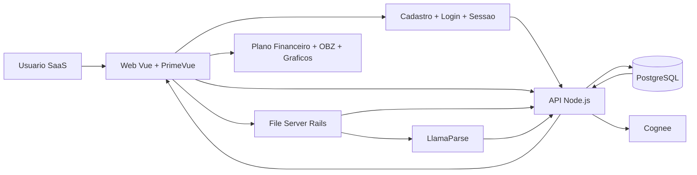

# Arquitetura do Projeto

## Objetivo da arquitetura

O projeto deve operar como um SaaS de controle financeiro familiar. A arquitetura precisa suportar cadastro de usuários, autenticação, autorização, isolamento por conta, ingestão manual de documentos financeiros, revisão humana do OCR, consolidação de renda e dívidas, cálculo de DTI, geração de planos Avalanche ou Bola de Neve e organização por Orçamento Base Zero, sem acoplar a aplicação principal ao armazenamento de arquivos ou à lógica de OCR.

## Decisão estrutural

A melhor base para o projeto é um monorepo com separação por domínio e por responsabilidade operacional:

- `apps/web` para experiência do usuário.
- `apps/api` para regras de negócio, orquestração e persistência.
- `apps/file-server` para upload e acesso seguro a documentos.
- `packages/finance-core` para o motor matemático compartilhado.
- `packages/shared-contracts` para contratos, schemas e tipos comuns.
- `packages/config-*` para centralizar lint, formatter e convenções.
- `docs` para arquitetura, MVP e decisões técnicas.
- `infra` para docker, compose e automações locais.

Essa divisão acelera o desenvolvimento porque isola pontos de mudança, evita duplicação da matemática financeira e permite que frontend, backend e servidor de arquivos evoluam com baixo acoplamento.

## Modelo SaaS e controle de acesso

- Todo acesso funcional deve ocorrer dentro de um contexto autenticado, exceto `healthchecks`, onboarding e fluxos públicos estritamente necessários.
- Cada usuário pertence a uma conta e só pode acessar famílias, documentos, diagnósticos e planos vinculados a essa conta.
- A API deve aplicar autorização por recurso em toda leitura e escrita. Receber um `householdId` válido não pode ser suficiente para conceder acesso.
- O cadastro inicial deve permitir criação de usuário, login seguro, revogação de sessão e recuperação controlada de acesso.
- O file server deve aceitar operações apenas quando houver identidade validada e escopo autorizado para o documento.
- Eventos sensíveis, como login, upload, revisão OCR e alteração de plano, devem produzir trilha mínima de auditoria.

## Estrutura de pastas recomendada

```text
controle_financeiro/
|-- .github/
|   |-- copilot-instructions.md
|   |-- instructions/
|   `-- prompts/
|-- apps/
|   |-- web/
|   |   |-- src/
|   |   |   |-- app/
|   |   |   |   |-- router/
|   |   |   |   `-- layouts/
|   |   |   |-- modules/
|   |   |   |   |-- intake/
|   |   |   |   |-- diagnosis/
|   |   |   |   |-- plans/
|   |   |   |   |-- budget/
|   |   |   |   `-- dashboard/
|   |   |   `-- shared/
|   |   |       |-- api/
|   |   |       |-- components/
|   |   |       |-- charts/
|   |   |       |-- formatters/
|   |   |       |-- validators/
|   |   |       `-- styles/
|   |   |-- cypress/
|   |   `-- public/
|   |-- api/
|   |   |-- src/
|   |   |   |-- app/
|   |   |   |   |-- plugins/
|   |   |   |   `-- routes/
|   |   |   |-- modules/
|   |   |   |   |-- health/
|   |   |   |   |-- intake/
|   |   |   |   |-- diagnosis/
|   |   |   |   |-- plans/
|   |   |   |   `-- budget/
|   |   |   |-- infra/
|   |   |   |   |-- db/
|   |   |   |   |   |-- migrations/
|   |   |   |   |   `-- seeds/
|   |   |   |   |-- clients/
|   |   |   |   |   |-- llamaparse/
|   |   |   |   |   |-- cognee/
|   |   |   |   |   `-- file-server/
|   |   |   |   `-- observability/
|   |   |   `-- shared/
|   |   `-- tests/
|   `-- file-server/
|       |-- app/
|       |-- config/
|       |-- db/
|       |-- storage/
|       `-- spec/
|-- packages/
|   |-- finance-core/
|   |   `-- src/
|   |       |-- dti/
|   |       |-- avalanche/
|   |       |-- snowball/
|   |       |-- budget-zero/
|   |       `-- currency/
|   |-- shared-contracts/
|   |   `-- src/
|   |-- eslint-config/
|   |-- prettier-config/
|   `-- tsconfig/
|-- docs/
|-- infra/
|   |-- compose/
|   |   |-- compose.base.yaml
|   |   |-- compose.dev.yaml
|   |   |-- compose.prod.yaml
|   |   |-- compose.test.yaml
|   |   `-- compose.tools.yaml
|   `-- docker/
|       |-- web.Dockerfile
|       |-- api.Dockerfile
|       `-- file-server.Dockerfile
|-- scripts/
|-- package.json
|-- pnpm-workspace.yaml
`-- turbo.json
```

## Padrão de containerização

- Toda a operação local e produtiva deve ser padronizada com Docker.
- A organização detalhada de arquivos, perfis, limites e comportamento dos composes fica em [docs/docker-e-compose.md](docs/docker-e-compose.md).
- A stack principal deve respeitar o teto de `2` vCPUs e `1 GiB` de RAM.
- O compose de desenvolvimento deve subir a stack completa local com banco e storage sob esse mesmo teto.
- O compose de produção deve usar imagens imutáveis e preferir dependências stateful externas quando isso reduzir risco operacional.

## Responsabilidades por aplicação

### apps/web

- Exibir onboarding, cadastro, login e recuperação de acesso do usuário SaaS.
- Receber uploads de extratos, comprovantes e documentos.
- Exibir revisão de OCR com `FileUpload` e `DataTable` com Cell Editing.
- Apresentar DTI, envelopes de OBZ e plano de ação em cards e gráficos.
- Manter somente lógica de interface, estado de tela e chamadas HTTP.
- Nunca concentrar fórmula financeira final dentro de componente Vue.

### apps/api

- Validar entrada, orquestrar OCR, persistir dados e montar respostas para a UI.
- Calcular DTI, OBZ, Avalanche e Bola de Neve usando o pacote compartilhado.
- Centralizar autenticação, autorização por recurso, sanitização, logging, auditoria e tratamento de erros.
- Expor DTOs específicos por caso de uso, retornando somente os campos necessários para a tela ou integração consumidora.
- Expor endpoints estáveis e versionáveis para web e integrações futuras.

### apps/file-server

- Armazenar documentos e anexos com isolamento operacional.
- Validar tipo, tamanho e origem dos arquivos.
- Emitir URLs assinadas ou tokens temporários para acesso controlado.
- Não conter regra financeira, cálculo ou priorização de dívidas.

### packages/finance-core

- Conter funções puras para DTI, priorização Avalanche, priorização Bola de Neve e OBZ.
- Usar precisão decimal do início ao fim.
- Ser a única fonte de verdade para fórmulas financeiras.
- Ser testado de forma intensiva e independente da API.

### packages/shared-contracts

- Concentrar schemas compartilhados entre frontend e backend.
- Padronizar DTOs de onboarding, autenticação, upload, revisão de OCR, diagnóstico, dívidas, envelopes e planos.
- Reduzir divergência entre payload esperado pela UI e payload entregue pela API.
- Separar contratos de listagem, detalhe e atualização quando isso evitar overfetching ou exposição de campos internos.

## Fluxo operacional principal



## Organização interna recomendada

### Frontend

- Organize por feature em `modules/` e deixe elementos reutilizáveis em `shared/`.
- Mantenha páginas, componentes, serviços e testes próximos da feature.
- Use Vue Router para fluxo principal e Pinia apenas quando o estado realmente atravessar múltiplas telas.
- Quando usar store, prefira stores pequenas por domínio, com nomes explícitos e sem regras matemáticas pesadas.

### Backend

- Cada módulo deve ter schema, controller, service e repository claramente separados.
- Validação deve ocorrer na borda da aplicação.
- Regras matemáticas e critérios de priorização devem ficar fora da camada HTTP.
- Integrações externas devem ser encapsuladas em `infra/clients`.

## Tecnologias recomendadas para execução do plano

| Camada | Recomendação | Motivo principal |
|---|---|---|
| Workspace JS | `pnpm workspaces` + `turbo` | Instalação rápida, cache e execução padronizada |
| Linguagem web e API | TypeScript estrito | Menos ambiguidade em contratos e cálculos |
| Frontend | Vue 3 com Options API + Vite | Arranque rápido e aderência ao requisito do projeto |
| UI | PrimeVue | Componentes empresariais prontos e consistentes |
| Gráficos | ApexCharts | Boa leitura para dashboards financeiros |
| Backend | Fastify | Validação e desempenho com baixo overhead |
| Validação | Zod | Reuso de contratos entre frontend e backend |
| Banco | PostgreSQL + Drizzle ORM | Produtividade com segurança e migrations claras |
| Logs | Pino | Estruturação simples e performática |
| File server | Rails API + Active Storage | Ecossistema maduro para arquivos e assinaturas |
| Armazenamento local | MinIO em dev | Simula object storage sem depender de cloud |
| Containerização | Docker + Docker Compose | Padronização entre dev e produção com orçamento fixo de recursos |

## Entidades iniciais do domínio

- `users` para identidade, autenticação e ciclo de acesso.
- `account_memberships` para vínculo entre usuário, conta e papéis autorizados.
- `households` para o núcleo familiar atendido.
- `people` para membros da família e fontes de renda.
- `documents` para arquivos enviados e seu status de processamento.
- `ocr_entries` para linhas revisáveis extraídas do OCR.
- `incomes` para receitas recorrentes e extraordinárias.
- `debts` para passivos, juros, saldo, atraso e prioridade.
- `budget_envelopes` para categorias do Orçamento Base Zero.
- `action_plans` para o plano financeiro consolidado.
- `plan_installments` para projeções mensais do plano.
- `audit_events` para trilha mínima de ações sensíveis.

## Regras arquiteturais obrigatórias

- Sem integração direta com Open Finance no MVP.
- Sem lógica financeira dentro de componentes Vue.
- Sem acesso direto do frontend ao banco ou ao storage.
- Sem endpoint funcional sem contexto autenticado, exceto onboarding e saúde do serviço.
- Sem acesso cruzado entre contas, famílias ou documentos por simples conhecimento de identificadores.
- Sem payload genérico que retorne agregados completos quando a tela consumir apenas resumo, lista ou subconjunto de campos.
- Sem interpolação manual de SQL.
- Sem acoplamento da API ao mecanismo interno do file server.
- Sem aceitar payload de OCR sem validação e sanitização.
- Sem compose principal acima de `2` vCPUs e `1 GiB` de RAM.